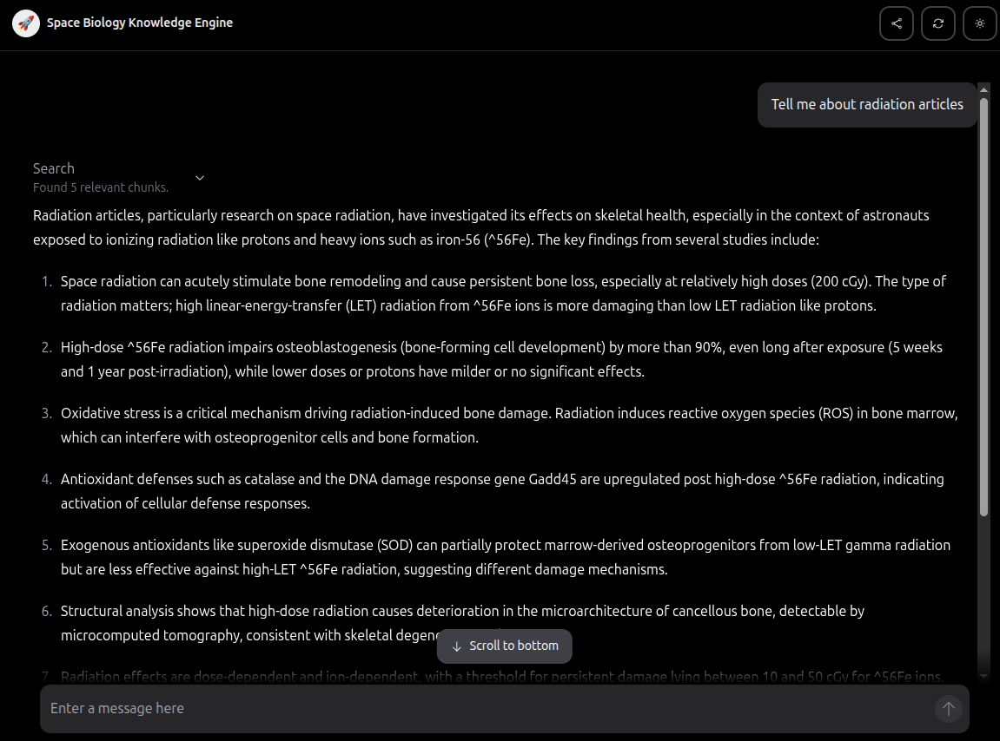
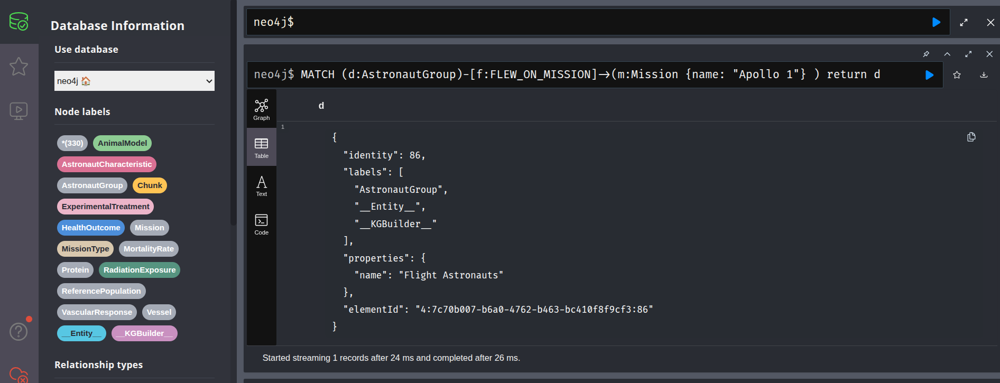

# AI driven NASA knowledge base

AI driven NASA knowledge base is a fully operational solution designed to make the knowledge from 608 NASA bioscience publications accessible to a wide audience.
Our goal is to democratize complicated science knowledge and make it available to everybody. The system uses a robust data processing pipeline to download, convert, and extract semantics from XML articles before ingesting them into databases. It offers three distinct user interfaces:
- Chat interface for geeks without a scientific background. 
- Graph interface for scientists exploring deep connections.
- Query interface for engineers seeking exact details.

## Installation and setup
Install uv:
```
curl -LsSf https://astral.sh/uv/install.sh | sh
```

Install dependencies and the package itself
```
uv venv --python=3.12
uv pip install -e .
```

Copy `.env.template file`, name it `.env` and provide required environment variables.

## Running processing
Extracting structured data from articles
```
python scripts/article_process.py
```

Move extracted articles to `data` folder.

## Setting up infrastructure
Running vector and graph databases
```
docker-compose up -d
```

## Data ingestion

**Needs to be done only one time**

Ingest documents into vector database
```
python -m nasa_hackathon.ingest
```

Ingest documents into graph database
```
python scripts/build_graph.py
```

## Usage

### Chat interface

Running chat UI app:
```
python -m nasa_hackathon.app
```

visit `http://127.0.0.1:8000`

### Graph interface

Visit `http://localhost:7474/browser/`. Click on the left side on database icon. Browse entities and relationships.

### Command line interface

Visit `http://localhost:7474/browser/` and provide your `Cypher` query into command line at the top.

Example query:
```
MATCH (d:AstronautGroup)-[f:FLEW_ON_MISSION]->(m:Mission {name: "Apollo 1"} ) return d
```