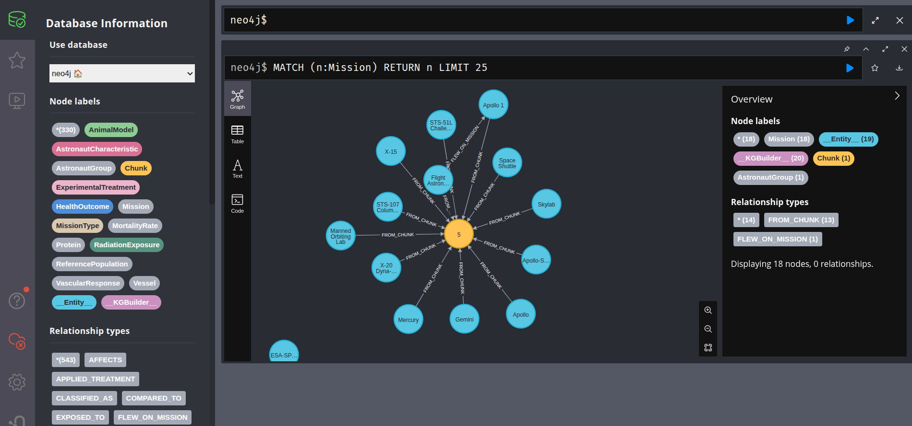

# AI driven NASA knowledge base

AI driven NASA knowledge base is a fully operational solution designed to make the knowledge from 608 NASA bioscience publications accessible to a wide audience.
Our goal is to democratize complicated science knowledge and make it available to everybody. The system uses a robust data processing pipeline to download, convert, and extract semantics from XML articles before ingesting them into databases. It offers three distinct user interfaces:
- Chat interface for geeks without a scientific background. 
- Graph interface for scientists exploring deep connections.
- Query interface for engineers seeking exact details.

## Installation and setup
Install uv:
```
curl -LsSf https://astral.sh/uv/install.sh | sh
```

Install dependencies and the package itself
```
uv venv --python=3.12
uv pip install -e .
```

Copy `.env.template file`, name it `.env` and provide required environment variables.

## Running processing
Extracting structured data from articles
```
python scripts/article_process.py
```

Move extracted articles to `data` folder.

## Setting up infrastructure
Running vector and graph databases
```
docker compose up -d
```

## Data ingestion

**Needs to be done only one time**

Ingest documents into vector database
```
python -m nasa_hackathon.ingest
```

Ingest documents into graph database
```
python scripts/build_graph.py
```

## Usage

### Chat interface

Running chat UI app:
```
python -m nasa_hackathon.app
```

visit `http://127.0.0.1:8000`

### Graph interface

Visit `http://localhost:7474/browser/`. Click on the left side on database icon. Browse entities and relationships.

### Command line interface

Visit `http://localhost:7474/browser/` and provide your `Cypher` query into command line at the top.

Example query:
```
MATCH (d:AstronautGroup)-[f:FLEW_ON_MISSION]->(m:Mission {name: "Apollo 1"} ) return d
```

## Deployment
install azure cli
```
curl -sL https://packages.microsoft.com/keys/microsoft.asc | gpg --dearmor | sudo tee /usr/share/keyrings/microsoft.gpg > /dev/null
echo "deb [arch=$(dpkg --print-architecture) signed-by=/usr/share/keyrings/microsoft.gpg] https://packages.microsoft.com/repos/azure-cli/ $(lsb_release -cs) main" | sudo tee /etc/apt/sources.list.d/azure-cli.list
sudo apt-get update && sudo apt-get install -y azure-cli
az version
```

Build and push image to register
```
az login
az provider register --namespace Microsoft.ContainerRegistry (only once)
az acr create --resource-group nasa_hackathon --name nasahackathonacr --sku Basic
az acr login --name nasahackathonacr
docker build -t nasahackathonacr.azurecr.io/myapp:tag .
docker push nasahackathonacr.azurecr.io/myapp:tag
```

Install kubectl, k9s and deploy
```
curl -LO "https://dl.k8s.io/release/$(curl -L -s https://dl.k8s.io/release/stable.txt)/bin/linux/amd64/kubectl"
sudo install -o root -g root -m 0755 kubectl /usr/local/bin/kubectl
az provider register --namespace Microsoft.Insights
az provider register --namespace Microsoft.ContainerService
az aks create --resource-group nasa_hackathon --name nasaAKSCluster --node-count 2 --generate-ssh-keys --node-vm-size Standard_B2s
az aks get-credentials --resource-group nasa_hackathon --name nasaAKSCluster
az aks update -n nasaAKSCluster -g nasa_hackathon --attach-acr nasahackathonacr
kubectl create configmap api-config --from-env-file=.env

kubectl apply -f deployment.yaml
kubectl get svc api

curl -s https://api.github.com/repos/derailed/k9s/releases/latest \
| grep "browser_download_url.*Linux_amd64.tar.gz" \
| cut -d '"' -f 4 \
| wget -i -

tar -xzf k9s_Linux_amd64.tar.gz
sudo mv k9s /usr/local/bin/

kubectl delete job ingest-job
kubectl get pods
```